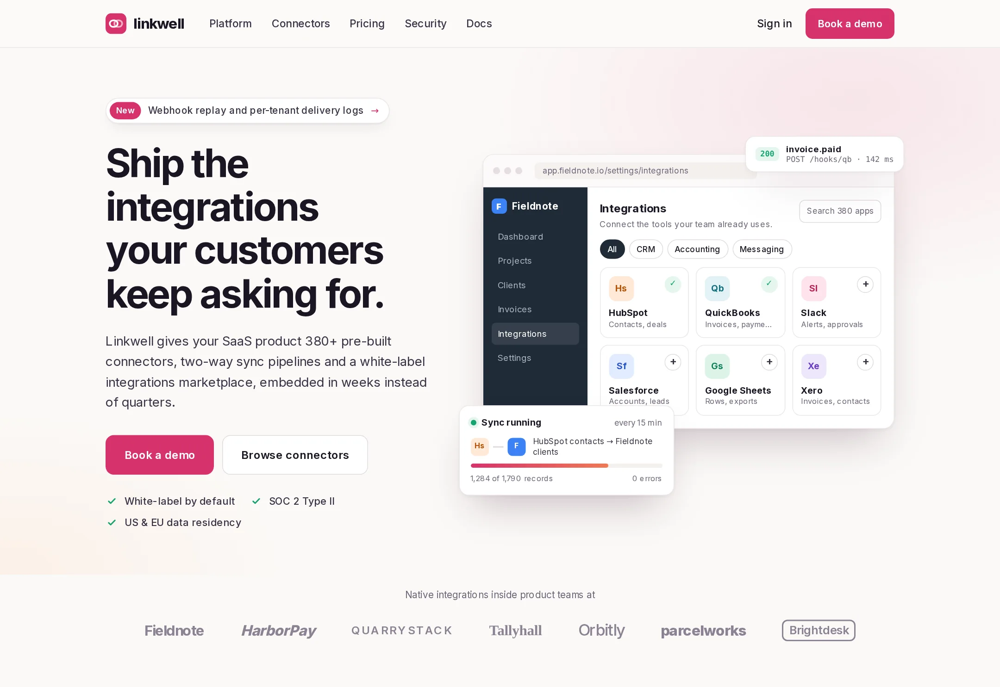

# Linkwell

Embedded integrations for SaaS products: pre-built connectors, sync pipelines, webhooks and a white-label marketplace.

**Live demo:** https://www.freelancerportfoliohub.com/jameslee/projects/linkwell/index.html



## Overview

This repository contains the Linkwell marketing site, the integration core it describes, and the public TypeScript SDK. The site has one page per stage of the buying committee: platform depth for engineers, the connector catalog, plan gating and pricing for product, and architecture plus FAQ for security review. Every product surface on it (embedded marketplace, pipeline builder, webhook delivery log, tenant health) is a React component, and the catalog and pipeline builder render from the same connector registry and pipeline definitions the backend uses.

## Features

- **Five pages**: home, platform, connector catalog, pricing and security
- **Connector registry** (`lib/connectors`): typed `ConnectorDefinition`s with auth schemes, object schemas, cursor fields, rate limits and webhook signature schemes; lookup, category/capability filters and search
- **Sync engine** (`lib/sync`): pipeline definitions, trigger and filter conditions, dotted-path field mapping with transforms and a single upsert key, mapping validation against the source schema, and an incremental runner with per-tenant cursors, dedupe and conflict rules
- **Webhooks** (`/api/webhooks`): verifies each upstream app's signature, normalizes the payload into a Linkwell event with a stable idempotency key, and queues it for signed delivery with exponential backoff (`lib/events`)
- **Catalog API** (`/api/connectors`): filterable connector feed
- **SDK** (`sdk/`): `@linkwell/sdk` with tenant tokens, connections, pipeline runs, event replay, pagination, typed errors and webhook verification
- Interactive mockups: marketplace theming, delivery-log and tenant filters, embed code tabs, catalog search (press `/`) and an annual/monthly billing toggle

## Tech stack

| Area       | Choice                                           |
| ---------- | ------------------------------------------------ |
| Framework  | Next.js 15 (App Router), React 19                |
| Language   | TypeScript (strict)                              |
| Styling    | Global CSS with design tokens, Inter variable    |
| Validation | zod                                              |
| Crypto     | Node `crypto` HMAC (upstream and outbound)       |
| Workspace  | pnpm workspace: site + `sdk/` package            |

## Getting started

```bash
pnpm install
cp .env.example .env.local
pnpm dev
```

Open http://localhost:3000.

### Environment variables

| Variable                     | Description                                                                 |
| ---------------------------- | --------------------------------------------------------------------------- |
| `NEXT_PUBLIC_SITE_URL`       | Canonical site URL                                                          |
| `CONNECTION_WEBHOOK_SECRETS` | JSON map of connection id → `{ tenantId, connectorId, secret }` for webhook routing |

### Sending a test webhook

```bash
BODY='{"id":820982911946154500,"email":"jon@example.com","total_price":"199.00"}'
SIG=$(printf '%s' "$BODY" | openssl dgst -sha256 -hmac "$SHOPIFY_SECRET" -binary | base64)
curl -X POST "localhost:3000/api/webhooks?connection=conn_48sKshop" \
  -H "x-shopify-topic: orders/create" -H "x-shopify-hmac-sha256: $SIG" -d "$BODY"
# → 202 {"received":true,"event":{"id":"evt_…","type":"order.created"}}
```

## Project structure

```
.
├── app/
│   ├── api/            # connectors (catalog feed), webhooks (upstream receiver)
│   ├── connectors/     # connector catalog
│   ├── platform/
│   ├── pricing/
│   ├── security/
│   ├── globals.css
│   ├── layout.tsx
│   └── page.tsx
├── components/
│   ├── mockups/        # hero app, pipeline builder, delivery log, theming, code, tenant health…
│   ├── home/  platform/  connectors/  pricing/  security/
│   ├── layout/         # header, footer, logo mark
│   ├── sections/       # split, page hero, logo strip, CTA
│   └── ui/             # Button, Tile, Checks, StatusCode, Faq…
├── lib/
│   ├── connectors/     # registry, auth helpers, catalog/ definitions
│   ├── sync/           # pipeline runner, mapping, conditions, pipelines
│   ├── events/         # normalize, signing, delivery + retry policy
│   └── data/           # typed page content and mockup data
├── sdk/                # @linkwell/sdk
├── public/fonts/
└── types/
```

## Scripts

| Script           | Description                  |
| ---------------- | ---------------------------- |
| `pnpm dev`       | Start the dev server         |
| `pnpm build`     | Production build             |
| `pnpm start`     | Serve the production build   |
| `pnpm lint`      | ESLint                       |
| `pnpm typecheck` | TypeScript, no emit          |
| `pnpm sdk:build` | Build `@linkwell/sdk`        |
| `pnpm format`    | Prettier                     |
